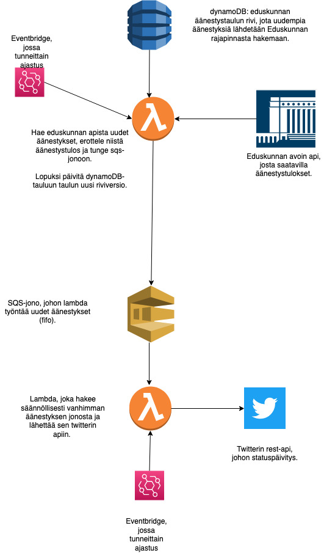

# aanestysbot

Botti hakee äänestystuloksia [Eduskunan avoimesta rajapinnasta](https://avoindata.eduskunta.fi/swagger/apidocs.html). Homma on tehty tietty clojurella, koska edelleen, clojure on rakkautta. 

Homma pyörii muutamalla lambdalla, kutakuinkin näin:

# TO DO
- Travishommelit tahi muut vastaavat, niin, että lamdojen deployaaminen menisi automatisoituna. 
- Ehkä äänestystulosten visualisointi tai kuvien haku?

